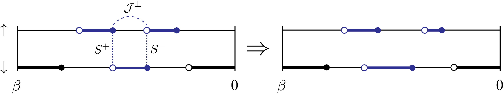

.. _moves:

Monte Carlo moves 
=================

In CTSEG-J, a configuration (state of the Markov chain) is a set of time-ordered list of segments (one for every color), and 
possibly a list of :math:`J_{\perp}` lines (see :doc:`Implementation Notes <../algorithm_implementation/implementation_notes>` for more details).
Below is a list of all possible steps (or "moves") of the random walk in configuration space. 

Insert segment
**************

.. image:: ../_static/insert.png
    :align: center
    :width: 80%

Randomly choose a color. Randomly choose a segment within that color. Try to insert a randomly chosen new segment in the interval to 
the right of that segment. If the color is empty, try to insert a random segment. If the color contains a full line, no insertion is possible. 

This move is enabled if there is a non-zero hybridization :math:`\Delta(\tau)`. 

Remove segment
**************

.. image:: ../_static/remove.png
    :align: center
    :width: 80%

Randomly choose a color. Try to remove a randomly chosen segment within that color. 

This move is enabled if there is a non-zero hybridization :math:`\Delta(\tau)`. 

Split segment
*************

Randomly choose a color and a segment :math:`[\tau, \tau']` within that color. Choose two random (but ordered) times :math:`[\tau_1, \tau_1']`
inside that segment and try replacing :math:`[\tau, \tau']` with :math:`[\tau, \tau_1]` and :math:`[\tau_1', \tau']`. 

This move is enabled if there is a non-zero hybridization :math:`\Delta(\tau)`. 

Regroup segment
***************

.. image:: ../_static/regroup.png
    :align: center
    :width: 80%

Randomly choose a color and a pair of adjacent segments :math:`[\tau, \tau_1]` and :math:`[\tau_1', \tau']` within that color. 
Try replacing this pair of segments with the "regrouped" segment :math:`[\tau, \tau']`.

This move is enabled if there is a non-zero hybridization :math:`\Delta(\tau)`. 

Move segment
************

.. image:: ../_static/move.png
    :align: center
    :width: 80%

Randomly choose a color and either a segment or an antisegment within that color (an antisegment is an interval between two segments). Randomly choose another 
color and try to insert the chosen segment or antisegment within that color. 

This move is enabled if there is a non-zero hybridization :math:`\Delta(\tau)`. 

.. note::

    The antisegment version of the move is implemented as the segment version 
    applied to a "flipped" configuration, where all the occupied time intervals become unoccupied, and vice-versa. 

.. note::

    The origin color and the destination color must be within the same block of the hybridization matrix. 

Insert spin segment
*******************

Randomly choose a color :math:`i` (spin up or spin down) and a segment :math:`[\tau, \tau']` within that color. The other color is denoted :math:`j`.
Choose two random (but ordered) times :math:`\tau_1` and :math:`\tau_1'` within that segment. Try replacing :math:`[\tau, \tau']` with :math:`[\tau, \tau_1]` 
and :math:`[\tau_1, \tau']` in color :math:`i`, inserting :math:`[\tau_1, \tau_1']` in color :math:`j`, and inserting a :math:`J_{\perp}` line 
between :math:`\tau_1` and :math:`\tau_1'`. 

This move is enabled if there is a non-zero :math:`J_{\perp}(\tau)`. 

.. note::

    This and the following "spin moves" (that explore the configurations resulting from the :math:`J_{\perp}` expansion)
    are only implemented for the case where the configuration has two colors, spin up and spin down. 

Remove spin segment
*******************

.. image:: ../_static/remove_spin.png
    :align: center
    :width: 80%

Randomly choose a :math:`J_{\perp}` line. If its two endpoints are connected by a segment :math:`[\tau_1, \tau_1']` in color :math:`i`, find the segments 
:math:`[\tau, \tau_1]` and :math:`[\tau_1, \tau']` that it connects in color :math:`j`. Try removing the :math:`J_{\perp}` line and segment 
:math:`[\tau_1, \tau_1']` in color :math:`i`, and replacing :math:`[\tau, \tau_1]` and :math:`[\tau_1, \tau']` in color :math:`j` with a single 
segment :math:`[\tau, \tau']`. 

This move is enabled if there is a non-zero :math:`J_{\perp}(\tau)`. 

Swap spin lines
***************

.. image:: ../_static/swap_spin.png
    :align: center
    :width: 80%

Randomly choose two :math:`J_{\perp}` lines :math:`[\tau_+, \tau_-]` and :math:`[\tau'_+, \tau'_-]`. Try replacing them with the 
swapped lines :math:`[\tau'_+, \tau_-]` and :math:`[\tau_+, \tau'_-]`. 

This move is enabled if there is a non-zero :math:`J_{\perp}(\tau)`. 

Split spin segment
******************

Randomly choose a :math:`J_{\perp}` line. Try to remove the :math:`J_{\perp}` line, and shift the :math:`c` operators at 
its end points in each of the colors by independent random amounts. 

This move is enabled if there is a non-zero :math:`J_{\perp}(\tau)` and a non-zero :math:`\Delta(\tau)`. 

Regroup spin segment
********************

.. image:: ../_static/regroup_spin.png
    :align: center
    :width: 80%

Randomly choose a :math:`c` operator in color 0 (spin up) and determine the window :math:`[\tau_0, \tau_0']` in which this :math:`c` operator can be moved.
In color 1 (spin down), find the :math:`c^{\dagger}` operators in :math:`[\tau_0, \tau_0']` and choose one of them at random (denote its time :math:`\tau_1''`). 
Randomly choose a :math:`c` operator in color 1 (spin down) and determine the window :math:`[\tau_1, \tau_1']` in which this :math:`c` operator can be moved.
In color 0 (spin up), find the :math:`c^{\dagger}` operators in :math:`[\tau_1, \tau_1']` and choose one of them at random (denote its time :math:`\tau_0''`). 
Try to shift the :math:`c` operator in color 0 to :math:`\tau_1''`, the :math:`c` operator in color 1 to :math:`\tau_0''`, and create a :math:`J_{\perp}` line 
between :math:`\tau_0''` and :math:`\tau_1''`. 

This move is enabled if there is a non-zero :math:`J_{\perp}(\tau)` and a non-zero :math:`\Delta(\tau)`. 

